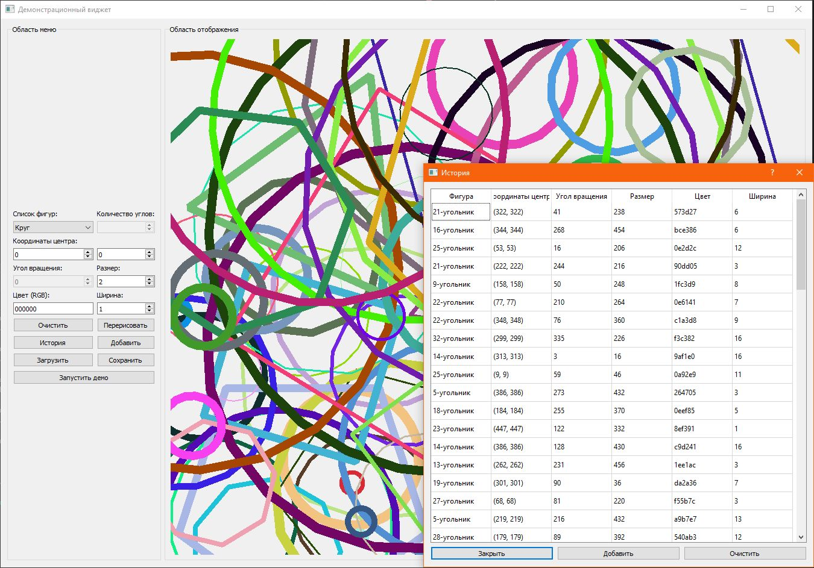

# FigurePainter
Тестовое задание на фронтенд C++/Qt (обратной связи не получил, но считаю выполненной). Требования по оформлению не стал делать, дополнительно реализовал демо режим вроде скринсейвера, при активации которого на экране каждые 0,5с будет рисоваться произвольная фигура.

# Задание
1. Реализовать окно с графическим интерфейсом, состоящее из двух областей: 
   * область меню;
   * область отображения.

   В области меню должны быть размещены следующие элементы управления: 
   * список геометрических фигур, доступных для выбора; 
   * поля ввода данных параметров фигур (размер, координаты, угол поворота вокруг центра масс и другие);
   * кнопки.
   
   По нажатию на одну из кнопок в области отображения должна появляться выбранная фигура с указанными пользователем размерами, координатами и поворотом вокруг центра масс. Нажатие другой кнопки очищает область отображения от всех фигур.

   Примеры фигур: круг, квадрат, правильный треугольник, n-угольник.
2. Реализовать второе окно графического интерфейса, содержащее таблицу с информацией обо всех когда-либо показанных пользователю фигурах. В рамках основного окна требуется добавить в основное окно приложения элемент управления позволяющий открыть новое окно модальным по отношению к первому. Строки таблицы должны содержать фигуры, а колонки - параметры фигур.
3. Реализовать функционал для отрисовки выбранной фигуры (строки) из таблицы в области отображения, кнопку в меню главного окна для отрисовки всех фигур из таблицы.

4. Реализовать сохранение и загрузку фигур из текстового файла с элементами управления параметрами сохранения/загрузки на отдельной вкладке области меню основного окна.

5. (опционально) Приведите внешний вид элементов графического интерфейса в соответствие дизайнерскому проекту интерфейса:
https://www.figma.com/file/QguVMvH37riErdDVvF6XNB/Exercise?type=design&node-id=0%3A1&mode=design&t=t9l8PZRjRcvi5piC-1

# Требования
При выполнении задания требуется использовать среду разработки QtCreator и фреймворк Qt 5.15 и выше.